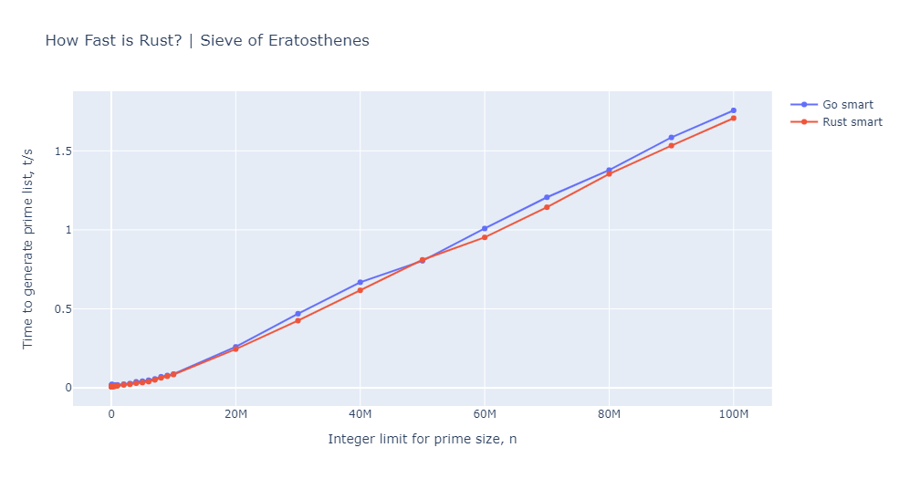
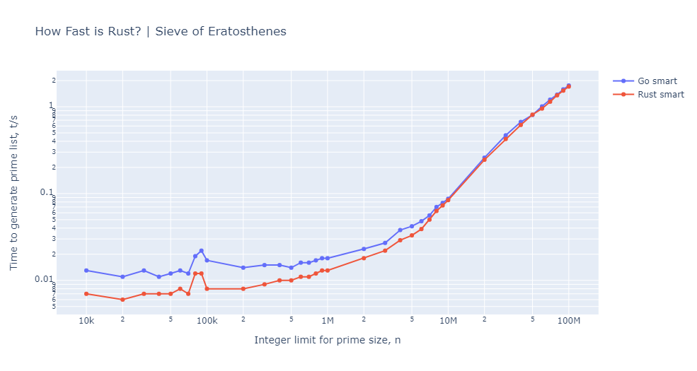

# Dumb and smart sieve of Erathosthenes analysis

The [original](https://github.com/aisrael/sieve-of-eratosthenes) implementation was not efficient, so I made optimization to both Go and Rust.
In order to compare before and after the improvement, I call the orignal implementation dumb and new one smart.

As you can see in the plot below, smart implementation is almost a flat horizontal line, and you can't see a difference between Go and Rust.


We can use log plot to see the difference, but it's still very insensitive to `n`.


We can extend the limit of `n`, but at this point, there is no reason to evaluate dumb versions, since they take just too much time.

I have plotted only smart versions up to 100 million.



and the log plot.



I have to say, both of them are very fast!
They take merely less than 2 seconds to generate prime numbers up to 100M!

Rust is slightly faster in small numbers of `n`, but I expect it comes from the initialization of runtime.
Go runtime is much bigger than Rust's, so it takes few tens of milliseconds extra to start a process.

In large numbers of `n`, the difference is very small.
This is natural in a way, because I have optimized the codes by removing
dynamic memory allocation as much as possible, so Golang's GC won't kick in.

The runtime cost would not be a big problem in Golang's applications, since
the language is designed for service application that spawns many tasks inside a process.

In order to make a fair evaluation, we should compare the actual time taken
in the algorithm, excluding process initialization, but I'm too lazy to do that.
We can already see that both languages asymptotically converge to the same curve.
It proves that Golang's and Rust's optimizers perform very similarly.

Another thing to note is that both of them asymptotically converge to linear function, in contrast to dumb implementation's super-linear curve.


## The source of inefficiency

Both Go and Rust implemenations suffer from the same problem, so I take Rust as an example.

The problem is this `sieve` function. It checks all the elements in the vector and check if it is a multiple of the factor by calculating modulo (ugh..) which is as bad as it can be.
It means you have to scan the entire vector no matter how many numbers are sieved away.

```rust
    fn sieve(primes: &mut Vec<usize>, factor: usize) {
        for i in 0..primes.len() {
            let value = primes[i];
            if value != 0 && value != factor {
                if value % factor == 0 {
                    primes[i] = 0;
                }
            }
        }
    }
```

This is because the original implementation used just a list of prime numbers
so that scanning was required to find the elements to sieve.

I have implemented this way:

```rust
    let mut primes = vec![true; n];
    primes[0] = false;
    primes[1] = false;

    for factor in 2..n {
        if primes[factor] {
            let mut multiple = 2;
            while factor * multiple < n {
                primes[factor * multiple] = false;
                multiple += 1;
            }
        }
    }
```

The `primes` variable is now a look up table rather than a list of numbers.
In this way you can randomly access the entry by a given number, which significantly reduce the amount of access to the memory, especially with a big `factor`.
Also the new buffer is a vector of bool, which consumes less memory than integer.

Another small trick to optimize is to always try to allocate a huge buffer in one go like this

```rust
let mut primes = vec![true; n];
```

rather than pushing elements one by one

```rust
let mut primes: Vec<usize> = Vec::new();

for i in 2..=n {
    primes.push(i);
}
```

which triggers resize and reallocation many times.

Of course, you can `reserve` before pushing to avoid reallocation.

```rust
primes.reserve(n);
```

But it is still better to pre-allocate buffer, because inserting an element
involves bounds checking.


## Result validation

You may suspect that smart implementation may be skipping something and not returning the correct result.
So do I.

So I added a unit test to check the compatibility between dumb and smart implementations.

```rust
#[test]
fn test_sieves() {
    assert_eq!(dumb_primes(10000), smart_primes(10000));
}
```

In fact, I found out that I had to assign false to 0 and 1 to make it compatible with the unit test. :)

```rust
    primes[0] = false;
    primes[1] = false;
```

